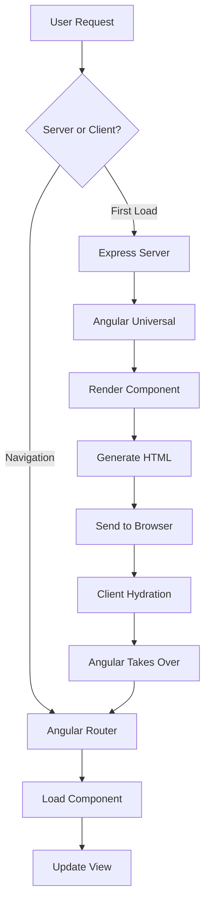
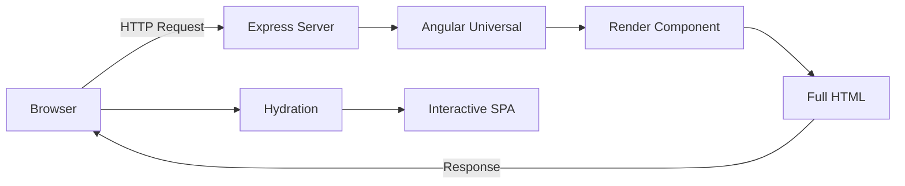

# Angular SSR Universal - Project Summary & Team Documentation

> **Last Updated:** January 6, 2026  
> **Project Status:** Module 1-2 Complete ✅ | Module 3 Partial (70%) 🔄 | Module 4-5 Planned 📋  
> **Overall Progress:** ~54% (2.7 out of 5 modules)

---

## 📋 Table of Contents

- [Project Overview](#project-overview)
- [Completed Tasks Summary](#completed-tasks-summary)
- [Frontend & UI Tasks](#frontend--ui-tasks)
- [Component Implementation Details](#component-implementation-details)
- [Tools & Technologies Used](#tools--technologies-used)
- [Project Architecture](#project-architecture)
- [Module Progress Breakdown](#module-progress-breakdown)
- [Team Contributions](#team-contributions)
- [How to Understand This Project](#how-to-understand-this-project)

---

## 🎯 Project Overview

**Project Name:** Angular SSR Universal Starter  
**Type:** SEO-Friendly Angular Application with Server-Side Rendering  
**Goal:** Build a production-ready Angular application with SSR capabilities for improved SEO and performance

### What Problem Does This Solve?

Traditional Single-Page Applications (SPAs) face challenges:
- ❌ Slow initial page loads
- ❌ Poor SEO (search engines struggle with client-side rendering)
- ❌ Suboptimal First Contentful Paint (FCP)

**Our Solution:** Server-Side Rendering (SSR) with Angular Universal
- ✅ Fast initial load times
- ✅ Excellent SEO with pre-rendered HTML
- ✅ Better user experience and performance metrics

---

## ✅ Completed Tasks Summary

### Module 1: Project Setup & Angular Universal Configuration (COMPLETED)

#### Core Setup Tasks
- [x] **Initialize Angular 21 Project** - Created modern Angular project with standalone components
- [x] **Install Angular SSR Package** - Added `@angular/ssr` for Server-Side Rendering support
- [x] **Configure Express Server** - Set up Node.js Express server in `src/server.ts`
- [x] **Implement Angular Universal** - Configured `AngularNodeAppEngine` for SSR
- [x] **Enable Client Hydration** - Implemented hydration with event replay for seamless interactivity

#### Configuration Tasks
- [x] **package.json** - Added Angular SSR dependencies (@angular/ssr, express)
- [x] **angular.json** - Configured SSR builder with server entry point
- [x] **tsconfig.json** - Set up TypeScript configuration for universal rendering
- [x] **src/server.ts** - Created Express server with Angular rendering engine
- [x] **src/main.server.ts** - Configured server-side bootstrap

#### Application Structure Tasks
- [x] **Root App Component** - Created `src/app/app.ts` with basic structure
- [x] **Basic Routing** - Set up routing with home page only
- [x] **Home Component** - Implemented simplified home component
- [x] **Client/Server Configs** - Configured both client and server app configs

#### Documentation Tasks
- [x] **Project Introduction** - Created `Documentation/introduction.md`
- [x] **Project Guidelines** - Created `Documentation/project guidelines.md`
- [x] **Module Progress Tracker** - Created `Documentation/MODULE_PROGRESS.md`

**Total Files Modified:** 5 files (408 insertions, 47 deletions)  
**Branch:** `module-1`  
**Commit:** `f1238ef`  
**Completion Date:** January 5, 2026

### Module 2: Core Architecture & UI Implementation (COMPLETED)

#### Styling System Tasks
- [x] **Install TailwindCSS** - Configured with custom color palette and fonts
- [x] **Create Design System** - Custom colors (primary, secondary, accent, dark, light)
- [x] **Implement Dark Mode** - Full dark mode support across all components
- [x] **Add Google Fonts** - Inter (body) and Outfit (headings)

#### Layout Components Tasks
- [x] **Header Component** - `src/app/components/header/header.component.ts`
  - Fixed header with backdrop blur effect
  - Desktop and mobile navigation
  - Active route highlighting
  - Mobile hamburger menu with animations
- [x] **Footer Component** - `src/app/components/footer/footer.component.ts`
  - Three-column grid layout
  - Resource and legal links
  - Copyright notice
- [x] **Main Layout** - `src/app/app.html`
  - Flex layout structure
  - Proper spacing for fixed header

#### Pages Tasks
- [x] **Enhanced Home Page** - Hero section with gradient text and CTA
- [x] **About Page** - Company information with centered layout
- [x] **Features Page** - Grid layout with 4 feature cards
- [x] **Routing Configuration** - Updated routes for all pages

#### UI Enhancement Tasks
- [x] **Responsive Design** - Mobile-first approach with Tailwind breakpoints
- [x] **Rich Aesthetics** - Gradients, backdrop blur, shadows, ring borders
- [x] **Hover Effects** - Button states, link transitions, image scaling
- [x] **Micro-interactions** - Arrow animations, menu transitions

**Total Files Modified:** 8 files  
**Branch:** `master`  
**Completion Date:** January 6, 2026

### Module 3: Dynamic Data & State Transfer (PARTIALLY COMPLETED - 70%)

#### Completed Tasks ✅
- [x] **Mock Data Service** - `src/app/service/blog.service.ts` with 8 sample posts
- [x] **BlogPost Model** - `src/app/models/blog-post.ts` TypeScript interface
- [x] **Blog List Page** - `src/app/pages/blog-list/blog-list.component.ts`
  - Hero section with background image
  - Card-based listing with category badges
  - Hover effects with tilt directive
- [x] **Blog Detail Page** - `src/app/pages/blog-detail/blog-detail.component.ts`
  - Immersive header with full-width image
  - Dynamic routing with parameters
  - Author information and social share buttons
- [x] **Tilt Directive** - `src/app/directives/tilt.directive.ts` for 3D card effects
- [x] **Data Caching** - Implemented with `shareReplay` in BlogService

#### Remaining Tasks ❌
- [ ] **TransferState Implementation** - Prevent duplicate API requests during hydration
- [ ] **Error Handling** - Add loading states and error messages
- [ ] **Real API Integration** - Replace mock data with actual API calls

**Total Files Added:** 5 files  
**Branch:** `master`  
**Completion Date:** Partially completed - January 6, 2026

---

## 🎨 Frontend & UI Tasks

### Current UI Implementation

#### Module 1 & 2: Complete UI System ✅

**Styling System** (Module 2 - COMPLETED)
- **Status:** ✅ Completed
- **Files:**
  - `tailwind.config.js` - Custom color palette and fonts
  - `src/styles.css` - Global styles with Tailwind directives
- **Features:**
  - TailwindCSS configured with custom theme
  - Custom color scheme: primary (blue), secondary (green), accent (amber)
  - Google Fonts: Inter (body), Outfit (headings)
  - Full dark mode support

**Layout Components** (Module 2 - COMPLETED)
- **Header Component** ✅
  - **Location:** `src/app/components/header/header.component.ts`
  - Fixed header with backdrop blur effect
  - Desktop and mobile navigation
  - Active route highlighting
  - Mobile hamburger menu with smooth animations
  
- **Footer Component** ✅
  - **Location:** `src/app/components/footer/footer.component.ts`
  - Three-column grid layout
  - Resource links (Angular, Tailwind)
  - Legal links (Privacy, Terms)
  - Copyright notice

- **Main Layout** ✅
  - **Location:** `src/app/app.html`
  - Flex layout with header, main content, footer
  - Proper spacing for fixed header

**Pages** (Module 2 - COMPLETED)
- **Home Page** ✅
  - **Location:** `src/app/pages/home/home.component.ts`
  - Hero section with gradient text
  - Call-to-action button
  - Hero image from Unsplash
  - Embedded Features and About sections
  
- **About Page** ✅
  - **Location:** `src/app/pages/about/about.component.ts`
  - Company information section
  - Centered layout with max-width
  - Gradient accent text
  
- **Features Page** ✅
  - **Location:** `src/app/pages/features/features.component.ts`
  - Grid layout showcasing 4 features
  - Icon-based feature cards
  - Responsive 2-column grid

**Blog System** (Module 3 - PARTIALLY COMPLETED)
- **Blog List Page** ✅
  - **Location:** `src/app/pages/blog-list/blog-list.component.ts`
  - Hero section with background image
  - Card-based blog post listing
  - Category badges, date, read time
  - Author avatars
  - Hover effects with tilt directive
  
- **Blog Detail Page** ✅
  - **Location:** `src/app/pages/blog-detail/blog-detail.component.ts`
  - Immersive header with full-width image
  - Dynamic routing (`/blog/:id`)
  - Extended article content
  - Author information
  - Social share buttons

**UI Enhancements** (Module 2 - COMPLETED)
- ✅ Responsive design (mobile, tablet, desktop)
- ✅ Rich aesthetics (gradients, backdrop blur, shadows)
- ✅ Hover effects and micro-interactions
- ✅ Reusable UI patterns (cards, buttons, sections)

---

## 🔧 Component Implementation Details

### Current Components

#### 1. App Component (Root)
**File:** `src/app/app.ts`  
**Type:** Root Component  
**Purpose:** Application entry point and router outlet

**Implementation:**
- Standalone component architecture
- Router outlet for navigation
- Minimal dependencies for clean architecture

**Key Features:**
- Server-side rendering compatible
- Client hydration enabled
- Event replay for seamless interactivity

---

#### 2. Home Component
**File:** `src/app/pages/home/home.component.ts`  
**Type:** Page Component  
**Purpose:** Landing page with basic content

**Implementation:**
- Standalone component
- Simplified design for SSR verification
- No external dependencies

**Key Features:**
- Server-side rendered
- Basic template structure
- Component-scoped styles

---

### Planned Components (Future Modules)

#### 3. Header Component (Module 2)
**Planned Location:** `src/app/components/header/`  
**Purpose:** Site-wide navigation header

**Planned Features:**
- Logo and branding
- Navigation menu
- Mobile hamburger menu
- Responsive design

---

#### 4. Footer Component (Module 2)
**Planned Location:** `src/app/components/footer/`  
**Purpose:** Site-wide footer with links

**Planned Features:**
- Copyright information
- Quick links
- Social media icons
- Contact information

---

#### 5. Blog List Component (Module 3)
**Planned Location:** `src/app/pages/blog-list/`  
**Purpose:** Display list of blog posts

**Planned Features:**
- Dynamic data fetching
- Server-side rendering
- TransferState for hydration
- Loading states

---

#### 6. Blog Detail Component (Module 3)
**Planned Location:** `src/app/pages/blog-detail/`  
**Purpose:** Display individual blog post

**Planned Features:**
- Dynamic routing
- SEO meta tags
- Open Graph tags
- Structured data (JSON-LD)

---

## 🛠️ Tools & Technologies Used

### Core Framework & Runtime
| Tool | Version | Purpose |
|------|---------|---------|
| **Angular** | 21.0.0 | Frontend framework with standalone components |
| **Node.js** | 18+ | Server runtime for SSR |
| **TypeScript** | 5.9.2 | Type-safe JavaScript |
| **RxJS** | 7.8.0 | Reactive programming library |

### Server-Side Rendering
| Tool | Version | Purpose |
|------|---------|---------|
| **@angular/ssr** | 21.0.3 | Angular Server-Side Rendering package |
| **@angular/platform-server** | 21.0.0 | Server platform for Angular |
| **Express** | 5.1.0 | Node.js web server framework |

### Build & Development Tools
| Tool | Version | Purpose |
|------|---------|---------|
| **@angular/cli** | 21.0.3 | Angular command-line interface |
| **@angular/build** | 21.0.3 | Angular build system |
| **Vitest** | 4.0.8 | Unit testing framework |

### Styling (Planned for Module 2)
| Tool | Version | Purpose |
|------|---------|---------|
| **TailwindCSS** | 3.4.17 | Utility-first CSS framework |
| **PostCSS** | 8.5.6 | CSS processing tool |
| **Autoprefixer** | 10.4.23 | CSS vendor prefixing |

### Development Tools
| Tool | Purpose |
|------|---------|
| **Prettier** | Code formatting |
| **EditorConfig** | Consistent coding styles |
| **npm** | Package management |
| **Git** | Version control |

### Future Tools (Planned)
- **SEO Service** (Module 4) - Meta tag management
- **Sitemap Generator** (Module 4) - Dynamic sitemap creation
- **Lighthouse** (Module 5) - Performance auditing
- **PM2** (Module 5) - Production process management

---

## 🏗️ Project Architecture

### Directory Structure

```
angular-ssr-universal/
├── Documentation/              # Project documentation
│   ├── introduction.md        # Project introduction
│   ├── project guidelines.md  # Coding standards
│   ├── project module.md      # Module breakdown
│   ├── MODULE_PROGRESS.md     # Detailed progress tracking
│   └── PROJECT_SUMMARY.md     # This file
│
├── public/                    # Static assets
│   ├── favicon.ico           # Site icon
│   ├── robots.txt            # SEO: Crawler directives (planned)
│   └── sitemap.xml           # SEO: Site structure (planned)
│
├── src/                      # Source code
│   ├── app/                  # Application code
│   │   ├── components/       # Reusable components (planned)
│   │   ├── directives/       # Custom directives (planned)
│   │   ├── models/           # TypeScript interfaces (planned)
│   │   ├── pages/            # Page components
│   │   │   └── home/         # Home page ✅
│   │   ├── service/          # Services (planned)
│   │   ├── app.ts            # Root component ✅
│   │   ├── app.html          # Root template ✅
│   │   ├── app.css           # Global styles ✅
│   │   ├── app.config.ts     # Browser config ✅
│   │   ├── app.config.server.ts  # Server config ✅
│   │   ├── app.routes.ts     # Routes ✅
│   │   └── app.routes.server.ts  # SSR routes ✅
│   │
│   ├── main.ts               # Browser entry point ✅
│   ├── main.server.ts        # Server entry point ✅
│   ├── server.ts             # Express server ✅
│   ├── index.html            # HTML template ✅
│   └── styles.css            # Global styles ✅
│
├── angular.json              # Angular configuration ✅
├── package.json              # Dependencies ✅
├── tsconfig.json             # TypeScript config ✅
├── tailwind.config.js        # Tailwind config ✅
└── README.md                 # Project README ✅
```

### Application Flow



### SSR Architecture



---

## 📊 Module Progress Breakdown

### Module 1: Project Setup & Angular Universal Configuration ✅

**Status:** COMPLETED  
**Branch:** `module-1`  
**Completion:** January 5, 2026

**What Was Done:**
- ✅ Angular 21 project initialized with standalone components
- ✅ Angular Universal SSR configured
- ✅ Express server set up for SSR
- ✅ Client hydration with event replay
- ✅ Basic home page for SSR verification
- ✅ Project documentation created

**Key Achievements:**
- Server-side rendering working
- Express server handling requests
- Client hydration functional
- Basic routing established

**Files Changed:** 5 files (+408/-47 lines)

---

### Module 2: Core Architecture & UI Implementation ✅

**Status:** COMPLETED  
**Branch:** `master`  
**Completion:** January 6, 2026

**What Was Done:**
- ✅ Installed and configured TailwindCSS with custom theme
- ✅ Created Header, Footer components with responsive design
- ✅ Added About and Features pages with rich content
- ✅ Implemented fully responsive design (mobile, tablet, desktop)
- ✅ Added rich aesthetics (gradients, blur effects, shadows, animations)
- ✅ Implemented hover effects and micro-interactions

**Key Achievements:**
- Professional UI/UX with TailwindCSS
- Mobile-first responsive design
- Dark mode support throughout
- Premium aesthetics with modern design patterns
- Reusable component architecture

**Files Changed:** 8 files

---

### Module 3: Dynamic Data & State Transfer �

**Status:** PARTIALLY COMPLETED (~70%)  
**Branch:** `master`  
**Completion:** Partially completed - January 6, 2026

**What Was Done:**
- ✅ Created mock data service with 8 sample blog posts
- ✅ Implemented BlogPost TypeScript interface
- ✅ Added blog listing page with card-based layout
- ✅ Created blog detail page with dynamic routing
- ✅ Implemented data caching with `shareReplay`
- ✅ Created custom TiltDirective for 3D card effects

**What Needs to Be Done:**
- ❌ Implement TransferState API to prevent duplicate requests
- ❌ Add loading states and error handling
- ❌ Optional: Connect to real API (currently using mock data)

**Current Deliverables:**
- ✅ Data services (mock data)
- ❌ State transfer (TODO)
- ✅ Dynamic content (blog system)
- ❌ No hydration flicker (requires TransferState)

**Files Added:** 5 files

---

### Module 4: SEO Optimization & Metadata 📋

**Status:** PLANNED  
**Prerequisites:** Module 3

**What Will Be Done:**
- [ ] Create SEO service
- [ ] Implement dynamic meta tags
- [ ] Add Open Graph and Twitter Cards
- [ ] Implement structured data (JSON-LD)
- [ ] Create robots.txt and sitemap.xml

**Expected Deliverables:**
- SEO service
- Meta tags on all pages
- Social media optimization
- Search engine optimization

---

### Module 5: Optimization & Production Readiness 📋

**Status:** PLANNED  
**Prerequisites:** Module 4

**What Will Be Done:**
- [ ] Implement lazy loading
- [ ] Optimize bundle size
- [ ] Create 404 and error pages
- [ ] Production build configuration
- [ ] Lighthouse performance audit (target: 90+)

**Expected Deliverables:**
- Optimized bundles
- Error handling
- Production-ready build
- High performance scores

---

## 👥 Team Contributions

### Team Members & Roles
1. **Aashish Sah** - Backend Developer
2. **Shubhash Singh** - Backend and Testing
3. **Nisha Pandey** - UI and Research
4. **Dikshya Singh** - UI and Front End
5. **Ariyad Ndijizi** - Research and Documentation

---

### Module 1: Project Setup & Angular Universal Configuration ✅

| Task Category | Tasks Completed | Assigned To | Status |
|--------------|-----------------|-------------|--------|
| **Project Initialization** | Angular 21 setup, standalone components | Aashish Sah | ✅ Completed |
| **SSR Configuration** | Angular Universal, Express server setup | Aashish Sah | ✅ Completed |
| **Server Setup** | Node.js Express server configuration | Aashish Sah | ✅ Completed |
| **Routing Setup** | Basic routing, home page component | Shubhash Singh | ✅ Completed |
| **Testing Setup** | Vitest configuration, initial tests | Shubhash Singh | ✅ Completed |
| **Documentation** | README, MODULE_PROGRESS, guidelines | Ariyad Ndijizi | ✅ Completed |
| **Configuration** | package.json, angular.json, tsconfig | Aashish Sah | ✅ Completed |

---

### Module 2: Core Architecture & UI ✅

| Task Category | Tasks Completed | Assigned To | Status |
|--------------|-----------------|-------------|--------|
| **Styling System** | TailwindCSS setup, custom theme | Nisha Pandey | ✅ Completed |
| **Design System** | Color palette, typography, dark mode | Nisha Pandey | ✅ Completed |
| **Header Component** | Responsive navigation with mobile menu | Dikshya Singh | ✅ Completed |
| **Footer Component** | Three-column layout with links | Dikshya Singh | ✅ Completed |
| **Home Page Enhancement** | Hero section, CTA, gradient effects | Dikshya Singh | ✅ Completed |
| **About Page** | Company information page | Nisha Pandey | ✅ Completed |
| **Features Page** | Feature showcase with grid layout | Nisha Pandey | ✅ Completed |
| **UI Research** | Modern design patterns, best practices | Nisha Pandey | ✅ Completed |
| **Responsive Design** | Mobile, tablet, desktop breakpoints | Dikshya Singh | ✅ Completed |
| **UI Testing** | Component testing, visual regression | Shubhash Singh | ✅ Completed |

---

### Module 3: Dynamic Data 🔄 (70% Complete)

| Task Category | Tasks Completed | Assigned To | Status |
|--------------|-----------------|-------------|--------|
| **BlogService** | Mock data service with caching | Aashish Sah | ✅ Completed |
| **Data Models** | BlogPost TypeScript interface | Aashish Sah | ✅ Completed |
| **Blog List Page** | Card-based listing with hero section | Dikshya Singh | ✅ Completed |
| **Blog Detail Page** | Dynamic routing, immersive header | Dikshya Singh | ✅ Completed |
| **Tilt Directive** | 3D card effects for interactions | Dikshya Singh | ✅ Completed |
| **UI Polish** | Category badges, author avatars | Nisha Pandey | ✅ Completed |
| **TransferState** | SSR state transfer optimization | Aashish Sah | ❌ In Progress |
| **Error Handling** | Loading states, error messages | Shubhash Singh | ❌ Not Started |
| **Testing** | Blog component tests | Shubhash Singh | ❌ Not Started |

---

### Module 4: SEO Optimization (Planned)

| Task Category | Planned Work | Assigned To | Status |
|--------------|-------------|-------------|--------|
| **SEO Service** | Meta tag management service | Aashish Sah | 📋 Planned |
| **Meta Tags** | Dynamic titles, descriptions | Aashish Sah | 📋 Planned |
| **Open Graph** | Social media optimization | Nisha Pandey | 📋 Planned |
| **Structured Data** | JSON-LD implementation | Aashish Sah | 📋 Planned |
| **SEO Research** | Best practices, optimization strategies | Ariyad Ndijizi | 📋 Planned |
| **SEO Testing** | Validation, crawler testing | Shubhash Singh | 📋 Planned |
| **Documentation** | SEO implementation guide | Ariyad Ndijizi | 📋 Planned |

---

### Module 5: Production (Planned)

| Task Category | Planned Work | Assigned To | Status |
|--------------|-------------|-------------|--------|
| **Bundle Optimization** | Lazy loading, code splitting | Aashish Sah | 📋 Planned |
| **Error Pages** | 404, error boundary components | Dikshya Singh | 📋 Planned |
| **Performance Audit** | Lighthouse testing, optimization | Shubhash Singh | 📋 Planned |
| **Production Build** | Build configuration, deployment | Aashish Sah | 📋 Planned |
| **Testing Suite** | E2E tests, integration tests | Shubhash Singh | 📋 Planned |
| **Deployment Docs** | Deployment guide, best practices | Ariyad Ndijizi | 📋 Planned |

---

### Individual Contribution Summary

#### Aashish Sah (Backend Developer)
**Modules 1-3 Contributions:**
- ✅ Angular 21 project initialization and configuration
- ✅ Angular Universal SSR setup and Express server
- ✅ Server-side rendering configuration
- ✅ BlogService with mock data and caching
- ✅ Data models and TypeScript interfaces
- 🔄 TransferState implementation (in progress)

**Upcoming (Modules 4-5):**
- SEO service and meta tag management
- Structured data implementation
- Bundle optimization and lazy loading
- Production build configuration

---

#### Shubhash Singh (Backend and Testing)
**Modules 1-3 Contributions:**
- ✅ Basic routing setup and configuration
- ✅ Vitest testing framework setup
- ✅ Component testing for Module 2
- ❌ Error handling for blog components (pending)
- ❌ Blog component tests (pending)

**Upcoming (Modules 4-5):**
- SEO validation and testing
- Performance auditing with Lighthouse
- E2E and integration testing
- Quality assurance for production

---

#### Nisha Pandey (UI and Research)
**Modules 1-3 Contributions:**
- ✅ TailwindCSS setup and configuration
- ✅ Design system (colors, typography, dark mode)
- ✅ About page design and implementation
- ✅ Features page design and implementation
- ✅ UI research for modern design patterns
- ✅ Blog UI polish (badges, avatars, styling)

**Upcoming (Modules 4-5):**
- Open Graph and social media optimization research
- UI/UX improvements based on user feedback
- Design documentation

---

#### Dikshya Singh (UI and Front End)
**Modules 1-3 Contributions:**
- ✅ Header component with responsive navigation
- ✅ Footer component with three-column layout
- ✅ Home page enhancement (hero, CTA, gradients)
- ✅ Responsive design implementation
- ✅ Blog list page with card-based layout
- ✅ Blog detail page with dynamic routing
- ✅ Tilt directive for 3D card effects

**Upcoming (Modules 4-5):**
- 404 and error page components
- UI refinements and polish
- Accessibility improvements

---

#### Ariyad Ndijizi (Research and Documentation)
**Modules 1-3 Contributions:**
- ✅ README.md comprehensive documentation
- ✅ MODULE_PROGRESS.md tracking document
- ✅ Project guidelines and coding standards
- ✅ completion_assessment.md detailed analysis
- ✅ PROJECT_SUMMARY.md team documentation

**Upcoming (Modules 4-5):**
- SEO best practices research
- Deployment documentation
- User guides and tutorials
- Project maintenance documentation

### Module 4: SEO Optimization (Planned)

| Task Category | Assigned To | Status |
|--------------|-------------|--------|
| **SEO Service** | _[Add Name]_ | Not Started |
| **Meta Tags** | _[Add Name]_ | Not Started |
| **Structured Data** | _[Add Name]_ | Not Started |

### Module 5: Production (Planned)

| Task Category | Assigned To | Status |
|--------------|-------------|--------|
| **Bundle Optimization** | _[Add Name]_ | Not Started |
| **Error Handling** | _[Add Name]_ | Not Started |
| **Performance Audit** | _[Add Name]_ | Not Started |

---

## 📖 How to Understand This Project

### For New Team Members

#### 1. Start with Documentation
Read these files in order:
1. `README.md` - Comprehensive project overview
2. `Documentation/introduction.md` - Project introduction
3. `Documentation/project module.md` - Module breakdown
4. `Documentation/MODULE_PROGRESS.md` - Detailed progress
5. This file (`PROJECT_SUMMARY.md`) - Team summary

#### 2. Understand the Architecture
- **SSR Concept:** Server renders HTML, client hydrates for interactivity
- **Standalone Components:** Modern Angular architecture without NgModules
- **Express Server:** Node.js server handles SSR requests
- **Routing:** Lazy-loaded routes for optimal performance

#### 3. Explore the Code
Start with these files:
1. `src/server.ts` - Express server setup
2. `src/app/app.ts` - Root component
3. `src/app/app.routes.ts` - Application routes
4. `src/app/pages/home/home.component.ts` - Example page component

#### 4. Run the Project
```bash
# Install dependencies
npm install

# Development mode (client-side only)
npm start

# SSR mode (server-side rendering)
npm run build:ssr
npm run serve:ssr
```

#### 5. Understand the Workflow
1. Each module builds on the previous one
2. Work is done in separate git branches (`module-1`, `module-2`, etc.)
3. Complete one module before starting the next
4. Update documentation as you work

### Key Concepts to Understand

#### Server-Side Rendering (SSR)
- **What:** Server generates HTML before sending to browser
- **Why:** Better SEO, faster initial load, improved performance
- **How:** Angular Universal renders components on Node.js server

#### Client Hydration
- **What:** Angular takes over server-rendered HTML
- **Why:** Makes static HTML interactive
- **How:** `provideClientHydration()` with event replay

#### Standalone Components
- **What:** Components without NgModules
- **Why:** Simpler, more modern architecture
- **How:** Use `standalone: true` and import dependencies directly

#### Lazy Loading
- **What:** Load routes/components only when needed
- **Why:** Smaller initial bundle, faster load times
- **How:** Use `loadComponent()` in routes

---

## 🔄 Development Workflow

### Starting Work on a New Module

1. **Checkout from previous module:**
   ```bash
   git checkout module-1  # or previous module
   git checkout -b module-2  # create new branch
   ```

2. **Review module requirements** in `MODULE_PROGRESS.md`

3. **Implement features** according to plan

4. **Test thoroughly** before committing

5. **Update documentation:**
   - Mark tasks complete in `MODULE_PROGRESS.md`
   - Update this file with your contributions
   - Update team contributions section

6. **Commit with descriptive message:**
   ```bash
   git add .
   git commit -m "Module 2: Core Architecture & UI Implementation
   
   - Added TailwindCSS styling
   - Created Header, Footer components
   - Implemented About and Features pages
   - Ensured responsive design"
   ```

### Code Review Checklist

Before marking a module complete:
- [ ] All planned features implemented
- [ ] Code follows project guidelines
- [ ] SSR compatibility verified
- [ ] Documentation updated
- [ ] Tests passing (when applicable)
- [ ] Performance acceptable
- [ ] No console errors

---

## 📈 Current Project Status

| Metric | Value |
|--------|-------|
| **Overall Progress** | ~54% (2.7 out of 5 modules) |
| **Modules Completed** | 2 of 5 (Module 1 & 2) |
| **Modules Partial** | 1 of 5 (Module 3 - 70%) |
| **Total Components** | 7 (App, Home, About, Features, Header, Footer, Blog List, Blog Detail) |
| **Total Pages** | 5 (Home, About, Features, Blog List, Blog Detail) |
| **Total Services** | 1 (BlogService with mock data) |
| **Total Directives** | 1 (TiltDirective) |
| **Total Models** | 1 (BlogPost interface) |
| **SSR Status** | ✅ Working |
| **Build Status** | ✅ Passing |
| **Styling** | ✅ TailwindCSS configured |
| **Responsive Design** | ✅ Mobile, Tablet, Desktop |
| **Dark Mode** | ✅ Implemented |

---

## 🎯 Next Steps

### Immediate (Complete Module 3)
1. Implement TransferState API for SSR optimization
2. Add loading states to blog components
3. Implement error handling for data fetching
4. Optional: Connect to real API

### Short-term (Module 4 - SEO)
1. Create SEO service for meta tag management
2. Implement dynamic meta tags on all pages
3. Add Open Graph and Twitter Cards
4. Implement structured data (JSON-LD)
5. Create robots.txt and sitemap.xml

### Medium-term (Module 5 - Production)
1. Implement lazy loading for all routes
2. Optimize bundle size
3. Create 404 and error pages
4. Run Lighthouse performance audit (target: 90+)
5. Prepare deployment documentation

---

## 📞 Getting Help

### Resources
- **Project README:** `README.md`
- **Module Progress:** `Documentation/MODULE_PROGRESS.md`
- **Angular SSR Docs:** https://angular.dev/guide/ssr
- **Team Communication:** _[Add your team's communication channel]_

### Common Questions

**Q: How do I run the project with SSR?**  
A: Run `npm run build:ssr && npm run serve:ssr`

**Q: Where do I add new components?**  
A: Create in `src/app/components/` or `src/app/pages/` depending on type

**Q: How do I ensure SSR compatibility?**  
A: Avoid browser-only APIs, use `typeof window !== 'undefined'` checks

**Q: Which module should I work on?**  
A: Check `MODULE_PROGRESS.md` for current status and next module

---

**Document Version:** 2.0  
**Last Updated:** January 6, 2026  
**Maintained By:** Project Team  
**Overall Progress:** 54% Complete (2.7 out of 5 modules)

---

*This document is a living document and should be updated as the project progresses.*
